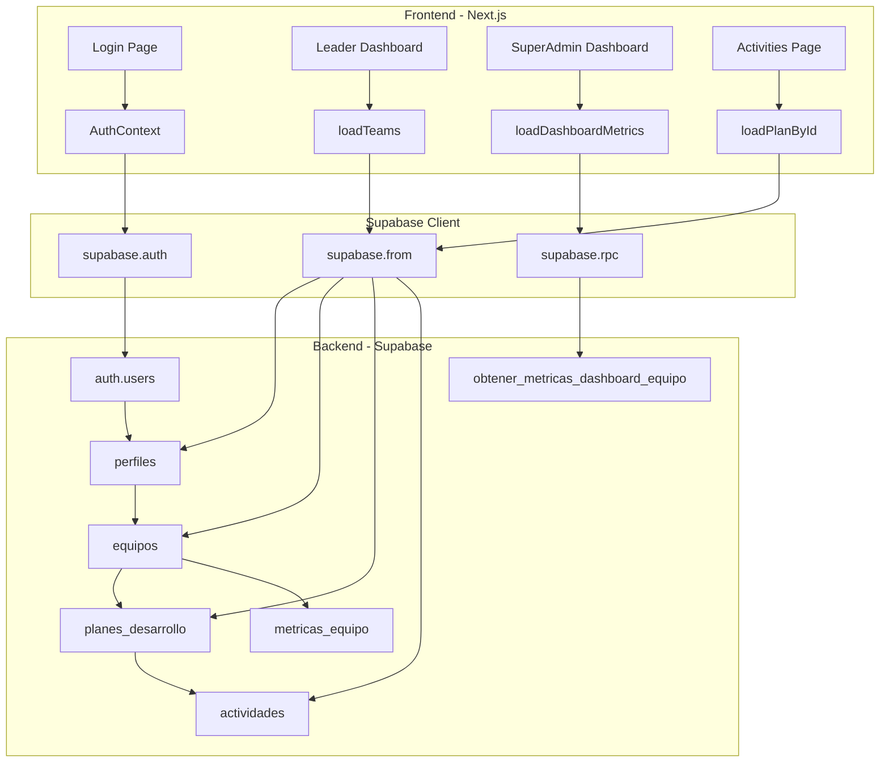

# Backend y Frontend: Relación y Flujos de Datos

Este documento explica cómo se relaciona el backend (Supabase) con el frontend (Next.js), incluyendo diagramas, mapeos de datos y ejemplos de flujos completos.

---

## 📐 Arquitectura General

```
┌─────────────────────────────────────────────────────────────┐
│                    FRONTEND (Next.js)                        │
│  ┌──────────────┐  ┌──────────────┐  ┌──────────────┐      │
│  │   Páginas    │  │  Componentes │  │   Contextos  │      │
│  │  (React)     │  │   (UI)       │  │  (Auth)      │      │
│  └──────┬───────┘  └──────┬───────┘  └──────┬───────┘      │
│         │                 │                  │              │
│         └─────────────────┴──────────────────┘              │
│                            │                                  │
│                   ┌────────▼────────┐                        │
│                   │  Supabase Client │                        │
│                   │  (@supabase/js) │                        │
│                   └────────┬────────┘                        │
└────────────────────────────┼──────────────────────────────────┘
                            │ HTTPS/REST
                            │ WebSocket (Realtime)
┌────────────────────────────▼──────────────────────────────────┐
│                    BACKEND (Supabase)                         │
│  ┌──────────────┐  ┌──────────────┐  ┌──────────────┐      │
│  │     Auth     │  │   Database   │  │  Edge/RPC    │      │
│  │  (JWT/Session)│  │ (PostgreSQL) │  │  Functions   │      │
│  └──────────────┘  └──────────────┘  └──────────────┘      │
│         │                 │                  │              │
│         └─────────────────┴──────────────────┘              │
│                            │                                  │
│                   ┌────────▼────────┐                        │
│                   │   Row Level     │                        │
│                   │   Security      │                        │
│                   │   (RLS)         │                        │
│                   └─────────────────┘                        │
└───────────────────────────────────────────────────────────────┘
```

---

## 🔄 Mapeo Frontend ↔ Backend

### Tabla de Mapeo de Tipos TypeScript a Tablas SQL

| **Frontend (TypeScript)** | **Backend (PostgreSQL)** | **Relación** |
|---------------------------|---------------------------|--------------|
| `AuthUser` | `perfiles` + `auth.users` | 1:1 |
| `Team` | `equipos` | 1:1 |
| `Member` | `miembros_equipo` + `perfiles` | N:M (a través de tabla intermedia) |
| `DevelopmentPlan` | `planes_desarrollo` | 1:1 |
| `AreaObjective` | `objetivos_area` | 1:1 |
| `Activity` | `actividades` | 1:1 |
| `TeamMetrics` | `metricas_equipo` | 1:1 |
| `DashboardTeamMetrics` | Vista agregada (RPC) | Calculado |

---

## 📊 Diagrama de Relaciones Completo



---

## 🔍 Mapeo Detallado de Objetos

### 1. Autenticación: `AuthUser` ↔ `perfiles`

**Frontend (`types.ts`):**
```typescript
export interface AuthUser {
  username: string;
  role: Role;  // 'superadmin' | 'leader' | 'member'
  teamId?: string;
}
```

**Backend (`perfiles`):**
```sql
CREATE TABLE perfiles (
  id UUID PRIMARY KEY REFERENCES auth.users(id),
  nombre_usuario TEXT UNIQUE NOT NULL,  -- → username
  rol rol_usuario NOT NULL,              -- → role
  id_equipo UUID REFERENCES equipos(id) -- → teamId
);
```

**Flujo de Login:**
```
1. Usuario ingresa username/password
   ↓
2. Frontend: supabase.auth.signInWithPassword()
   ↓
3. Supabase Auth valida credenciales
   ↓
4. Se crea sesión JWT
   ↓
5. Frontend consulta: supabase.from('perfiles').select('*').eq('id', user.id)
   ↓
6. Se obtiene: { nombre_usuario, rol, id_equipo }
   ↓
7. Se mapea a: { username, role, teamId }
   ↓
8. Se guarda en AuthContext
```

---

### 2. Equipos: `Team` ↔ `equipos`

**Frontend (`types.ts`):**
```typescript
export interface Team {
  id: string;
  name: string;
  leader: string;
  members: Member[];
  budgetAssigned: number;
  budgetLiquidated: number;
  budgetPending: number;
  plans: DevelopmentPlan[];
  metrics?: TeamMetrics;
}
```

**Backend (`equipos`):**
```sql
CREATE TABLE equipos (
  id UUID PRIMARY KEY,
  nombre TEXT NOT NULL,              -- → name
  id_lider UUID REFERENCES perfiles, -- → leader (se obtiene nombre)
  presupuesto_asignado NUMERIC        -- → budgetAssigned
);
```

**Flujo: Cargar Equipo Completo**
```typescript
// Frontend: loadTeams() → Supabase
const { data } = await supabase
  .from('equipos')
  .select(`
    *,
    id_lider:perfiles!equipos_id_lider_fkey(nombre_completo),
    planes_desarrollo(*),
    metricas_equipo(*),
    miembros_equipo(
      id_perfil:perfiles(nombre_completo, rol)
    )
  `)
  .eq('id', teamId);

// Transformación:
const team: Team = {
  id: data.id,
  name: data.nombre,
  leader: data.id_lider.nombre_completo,
  members: data.miembros_equipo.map(m => ({
    name: m.id_perfil.nombre_completo,
    role: m.rol
  })),
  budgetAssigned: data.presupuesto_asignado,
  budgetLiquidated: calcularLiquidado(data.planes_desarrollo),
  budgetPending: calcularPendiente(data.planes_desarrollo),
  plans: data.planes_desarrollo.map(transformPlan),
  metrics: transformMetrics(data.metricas_equipo)
};
```

---

### 3. Planes: `DevelopmentPlan` ↔ `planes_desarrollo`

**Frontend (`types.ts`):**
```typescript
export interface DevelopmentPlan {
  id: string;
  teamId: string;
  name: string;
  category: PlanCategory;
  status: PlanStatus;
  startDate: string;
  endDate: string;
  summary: string;
  objectives?: AreaObjective[];
  activities: Activity[];
}
```

**Backend (`planes_desarrollo`):**
```sql
CREATE TABLE planes_desarrollo (
  id UUID PRIMARY KEY,
  id_equipo UUID REFERENCES equipos,  -- → teamId
  nombre TEXT NOT NULL,                -- → name
  categoria categoria_plan NOT NULL,   -- → category
  estado estado_plan NOT NULL,         -- → status
  fecha_inicio DATE NOT NULL,          -- → startDate
  fecha_fin DATE NOT NULL,             -- → endDate
  resumen TEXT                         -- → summary
);
```

**Flujo: Obtener Plan con Actividades**
```typescript
// Frontend: loadPlanById(planId)
const { data } = await supabase
  .from('planes_desarrollo')
  .select(`
    *,
    objetivos_area(*),
    actividades(*)
  `)
  .eq('id', planId)
  .single();

// Transformación:
const plan: DevelopmentPlan = {
  id: data.id,
  teamId: data.id_equipo,
  name: data.nombre,
  category: data.categoria,
  status: data.estado,
  startDate: data.fecha_inicio,
  endDate: data.fecha_fin,
  summary: data.resumen,
  objectives: data.objetivos_area.map(obj => ({
    id: obj.id,
    planId: obj.id_plan,
    category: obj.categoria,
    description: obj.descripcion,
    order: obj.numero_orden
  })),
  activities: data.actividades.map(transformActivity)
};
```

---

### 4. Actividades: `Activity` ↔ `actividades`

**Frontend (`types.ts`):**
```typescript
export interface Activity {
  id: string;
  teamId: string;
  planId: string;
  objectiveId?: string;
  name: string;
  responsable: string;
  budgetTotal: number;
  budgetLiquidated: number;
  status: ActivityStatus;
  stage: string;
  area: string;
  objective: string;
  description: string;
  currentSituation: string;
  goalMid: string;
  goalLong: string;
  frequency: string;
  timesPerYear: number;
  startDate: string;
  endDate: string;
  totalWeeks: number;
  remainingWeeks: number;
  obstacles: string;
}
```

**Backend (`actividades`):**
```sql
CREATE TABLE actividades (
  id UUID PRIMARY KEY,
  id_equipo UUID REFERENCES equipos,        -- → teamId
  id_plan UUID REFERENCES planes_desarrollo, -- → planId
  id_objetivo UUID REFERENCES objetivos_area, -- → objectiveId
  nombre TEXT NOT NULL,                      -- → name
  responsable TEXT NOT NULL,                 -- → responsable
  presupuesto_total NUMERIC,                 -- → budgetTotal
  presupuesto_liquidado NUMERIC,             -- → budgetLiquidated
  estado estado_actividad NOT NULL,          -- → status
  etapa TEXT,                                -- → stage
  area TEXT NOT NULL,                        -- → area
  objetivo TEXT,                             -- → objective
  descripcion TEXT,                          -- → description
  situacion_actual TEXT,                     -- → currentSituation
  objetivo_mediano TEXT,                     -- → goalMid
  objetivo_largo TEXT,                       -- → goalLong
  frecuencia TEXT,                           -- → frequency
  veces_por_ano INTEGER,                     -- → timesPerYear
  fecha_inicio DATE NOT NULL,                -- → startDate
  fecha_fin DATE NOT NULL,                   -- → endDate
  semanas_totales INTEGER,                   -- → totalWeeks
  semanas_restantes INTEGER,                 -- → remainingWeeks
  obstaculos TEXT                            -- → obstacles
);
```

---

## 🔄 Flujos de Datos Completos

### Flujo 1: Login y Autenticación

```
┌─────────────┐
│   Usuario   │
│  ingresa    │
│ credentials │
└──────┬──────┘
       │
       ▼
┌─────────────────────────────────┐
│  Frontend: /login/page.tsx      │
│  - Formulario username/password  │
│  - handleSubmit()               │
└──────┬──────────────────────────┘
       │
       ▼
┌─────────────────────────────────┐
│  supabase.auth.signInWithPassword│
│  { email: username@misincol.local│
│    password: "..." }             │
└──────┬──────────────────────────┘
       │
       ▼
┌─────────────────────────────────┐
│  Supabase Auth                  │
│  - Valida credenciales          │
│  - Genera JWT token             │
│  - Retorna session              │
└──────┬──────────────────────────┘
       │
       ▼
┌─────────────────────────────────┐
│  Frontend: AuthContext          │
│  - Guarda session               │
│  - Consulta perfil              │
└──────┬──────────────────────────┘
       │
       ▼
┌─────────────────────────────────┐
│  supabase.from('perfiles')      │
│  .select('*')                    │
│  .eq('id', session.user.id)      │
└──────┬──────────────────────────┘
       │
       ▼
┌─────────────────────────────────┐
│  Backend: RLS Policy            │
│  - Verifica auth.uid()           │
│  - Permite SELECT propio perfil │
└──────┬──────────────────────────┘
       │
       ▼
┌─────────────────────────────────┐
│  Retorna: {                      │
│    id, nombre_usuario,           │
│    rol, id_equipo                │
│  }                               │
└──────┬──────────────────────────┘
       │
       ▼
┌─────────────────────────────────┐
│  Frontend: Mapea a AuthUser     │
│  { username, role, teamId }      │
│  - Guarda en localStorage       │
│  - Actualiza AuthContext         │
└──────┬──────────────────────────┘
       │
       ▼
┌─────────────────────────────────┐
│  Redirección según rol:         │
│  - superadmin → /superadmin/...  │
│  - leader → /leader/dashboard    │
└─────────────────────────────────┘
```

**Código Ejemplo:**
```typescript
// frontend/src/app/login/page.tsx
const handleSubmit = async (e: FormEvent) => {
  e.preventDefault();
  
  // 1. Autenticar con Supabase Auth
  const { data: authData, error: authError } = await supabase.auth.signInWithPassword({
    email: `${username}@misincol.local`,
    password: password
  });
  
  if (authError) throw authError;
  
  // 2. Obtener perfil
  const { data: perfil } = await supabase
    .from('perfiles')
    .select('*')
    .eq('id', authData.user.id)
    .single();
  
  // 3. Mapear y guardar
  const user: AuthUser = {
    username: perfil.nombre_usuario,
    role: perfil.rol,
    teamId: perfil.id_equipo
  };
  
  login(user);
  router.push(user.role === 'superadmin' ? '/superadmin/dashboard' : '/leader/dashboard');
};
```

---

### Flujo 2: Cargar Dashboard del Líder

```
┌─────────────────────────────────┐
│  Frontend: /leader/dashboard     │
│  - Componente Server            │
│  - await loadTeams()            │
└──────┬──────────────────────────┘
       │
       ▼
┌─────────────────────────────────┐
│  loadTeams()                    │
│  - Obtiene teamId de AuthContext│
│  - Construye query Supabase     │
└──────┬──────────────────────────┘
       │
       ▼
┌─────────────────────────────────┐
│  supabase.from('equipos')       │
│  .select(`                      │
│    *,                           │
│    id_lider:perfiles(...),      │
│    planes_desarrollo(            │
│      *,                         │
│      actividades(*)             │
│    ),                           │
│    metricas_equipo(*)           │
│  `)                             │
│  .eq('id', teamId)              │
│  .eq('planes_desarrollo.estado',│
│      'Activo')                  │
└──────┬──────────────────────────┘
       │
       ▼
┌─────────────────────────────────┐
│  Backend: RLS Policy            │
│  - Verifica obtener_rol_usuario()│
│  - Verifica obtener_id_equipo_  │
│    usuario()                    │
│  - Solo permite ver su equipo   │
└──────┬──────────────────────────┘
       │
       ▼
┌─────────────────────────────────┐
│  Retorna: {                      │
│    id, nombre,                   │
│    id_lider: { nombre_completo },│
│    planes_desarrollo: [          │
│      { id, nombre, estado,       │
│        actividades: [...] }      │
│    ],                            │
│    metricas_equipo: { ... }      │
│  }                               │
└──────┬──────────────────────────┘
       │
       ▼
┌─────────────────────────────────┐
│  Frontend: Transformación      │
│  - Mapea a Team interface       │
│  - Calcula presupuestos         │
│  - Filtra plan activo           │
└──────┬──────────────────────────┘
       │
       ▼
┌─────────────────────────────────┐
│  Renderiza Dashboard:           │
│  - Info del equipo              │
│  - Plan activo                  │
│  - Actividades pendientes       │
│  - Presupuesto                  │
│  - Métricas                     │
└─────────────────────────────────┘
```

**Código Ejemplo:**
```typescript
// frontend/src/lib/supabase-data.ts (nuevo archivo)
export async function loadTeamById(teamId: string): Promise<Team> {
  const { data, error } = await supabase
    .from('equipos')
    .select(`
      *,
      id_lider:perfiles!equipos_id_lider_fkey(
        nombre_completo,
        nombre_usuario
      ),
      planes_desarrollo(
        *,
        objetivos_area(*),
        actividades(*)
      ),
      metricas_equipo(*),
      miembros_equipo(
        activo,
        rol,
        id_perfil:perfiles(
          nombre_completo,
          nombre_usuario
        )
      )
    `)
    .eq('id', teamId)
    .single();
  
  if (error) throw error;
  
  // Transformar a Team
  const activePlan = data.planes_desarrollo.find(p => p.estado === 'Activo');
  const allActivities = activePlan?.actividades || [];
  
  return {
    id: data.id,
    name: data.nombre,
    leader: data.id_lider?.nombre_completo || data.id_lider?.nombre_usuario || '',
    members: data.miembros_equipo
      .filter(m => m.activo)
      .map(m => ({
        name: m.id_perfil.nombre_completo || m.id_perfil.nombre_usuario,
        role: m.rol
      })),
    budgetAssigned: data.presupuesto_asignado,
    budgetLiquidated: allActivities.reduce((sum, a) => sum + (a.presupuesto_liquidado || 0), 0),
    budgetPending: allActivities
      .filter(a => a.estado === 'Pendiente')
      .reduce((sum, a) => sum + (a.presupuesto_total - a.presupuesto_liquidado), 0),
    plans: data.planes_desarrollo.map(transformPlan),
    metrics: transformMetrics(data.metricas_equipo)
  };
}
```

---

### Flujo 3: Crear Nueva Actividad

```
┌─────────────────────────────────┐
│  Frontend: Modal de Actividad   │
│  - Formulario con campos        │
│  - Usuario completa datos       │
│  - Click "Guardar"              │
└──────┬──────────────────────────┘
       │
       ▼
┌─────────────────────────────────┐
│  handleSubmit()                 │
│  - Valida datos (Zod)          │
│  - Prepara objeto Activity      │
└──────┬──────────────────────────┘
       │
       ▼
┌─────────────────────────────────┐
│  supabase.from('actividades')   │
│  .insert({                      │
│    id_equipo: teamId,           │
│    id_plan: planId,             │
│    nombre: formData.name,        │
│    responsable: formData.resp,  │
│    presupuesto_total: amount,   │
│    estado: 'Pendiente',         │
│    fecha_inicio: startDate,     │
│    fecha_fin: endDate,          │
│    ...                          │
│  })                             │
└──────┬──────────────────────────┘
       │
       ▼
┌─────────────────────────────────┐
│  Backend: RLS Policy            │
│  - Verifica rol = 'leader'      │
│  - Verifica id_equipo =         │
│    obtener_id_equipo_usuario()  │
│  - Permite INSERT               │
└──────┬──────────────────────────┘
       │
       ▼
┌─────────────────────────────────┐
│  PostgreSQL: INSERT             │
│  - Crea registro                │
│  - Trigger actualiza            │
│    actualizado_en               │
└──────┬──────────────────────────┘
       │
       ▼
┌─────────────────────────────────┐
│  Retorna: { id, ... }           │
└──────┬──────────────────────────┘
       │
       ▼
┌─────────────────────────────────┐
│  Frontend: Actualiza UI         │
│  - Cierra modal                 │
│  - Refresca lista actividades   │
│  - Muestra toast "Creado"       │
└─────────────────────────────────┘
```

**Código Ejemplo:**
```typescript
// frontend/src/components/ui/activity-modal.tsx
const handleCreateActivity = async (formData: ActivityFormData) => {
  const { data, error } = await supabase
    .from('actividades')
    .insert({
      id_equipo: teamId,
      id_plan: planId,
      nombre: formData.name,
      responsable: formData.responsable,
      presupuesto_total: formData.budgetTotal,
      presupuesto_liquidado: 0,
      estado: 'Pendiente',
      etapa: formData.stage,
      area: formData.area,
      objetivo: formData.objective,
      descripcion: formData.description,
      situacion_actual: formData.currentSituation,
      objetivo_mediano: formData.goalMid,
      objetivo_largo: formData.goalLong,
      frecuencia: formData.frequency,
      veces_por_ano: formData.timesPerYear,
      fecha_inicio: formData.startDate,
      fecha_fin: formData.endDate,
      semanas_totales: calculateWeeks(formData.startDate, formData.endDate),
      semanas_restantes: calculateWeeks(formData.startDate, formData.endDate),
      obstaculos: formData.obstacles
    })
    .select()
    .single();
  
  if (error) {
    toast.error('Error al crear actividad');
    return;
  }
  
  toast.success('Actividad creada');
  onClose();
  router.refresh(); // Refresca la página
};
```

---

### Flujo 4: Dashboard SuperAdmin (Métricas Agregadas)

```
┌─────────────────────────────────┐
│  Frontend: /superadmin/dashboard│
│  - await loadDashboardMetrics()│
└──────┬──────────────────────────┘
       │
       ▼
┌─────────────────────────────────┐
│  supabase.rpc(                  │
│    'obtener_metricas_dashboard_  │
│    equipo'                       │
│  )                              │
└──────┬──────────────────────────┘
       │
       ▼
┌─────────────────────────────────┐
│  Backend: Función RPC           │
│  - SELECT con JOINs             │
│  - Agrega por equipo            │
│  - Calcula presupuestos         │
│  - Cuenta actividades           │
└──────┬──────────────────────────┘
       │
       ▼
┌─────────────────────────────────┐
│  Retorna: [                     │
│    {                            │
│      id_equipo,                 │
│      nombre_equipo,             │
│      lider,                     │
│      planes_completados_count,  │
│      actividades_pendientes_    │
│        count,                   │
│      presupuesto_liquidado,     │
│      presupuesto_pendiente      │
│    }, ...                       │
│  ]                              │
└──────┬──────────────────────────┘
       │
       ▼
┌─────────────────────────────────┐
│  Frontend: Mapea a             │
│  DashboardTeamMetrics[]        │
│  - Renderiza tabla              │
│  - Muestra métricas             │
└─────────────────────────────────┘
```

**Código Ejemplo:**
```typescript
// frontend/src/lib/supabase-data.ts
export async function loadDashboardMetrics(): Promise<DashboardTeamMetrics[]> {
  const { data, error } = await supabase.rpc('obtener_metricas_dashboard_equipo');
  
  if (error) throw error;
  
  return data.map(row => ({
    teamId: row.id_equipo,
    teamName: row.nombre_equipo,
    leader: row.lider,
    completedPlans: row.planes_completados_count,
    pendingActivities: row.actividades_pendientes_count,
    doneActivities: row.actividades_completadas_count,
    budgetLiquidated: row.presupuesto_liquidado,
    budgetPending: row.presupuesto_pendiente,
    budgetAssigned: row.presupuesto_asignado
  }));
}
```

---

## 🔐 Seguridad: Row Level Security (RLS)

### Cómo Funciona RLS en Cada Flujo

**Ejemplo: Líder consulta su equipo**

```sql
-- Política RLS en equipos
CREATE POLICY "Leaders can view own team"
  ON equipos FOR SELECT
  USING (
    obtener_rol_usuario() = 'leader' 
    AND id = obtener_id_equipo_usuario()
  );
```

**Flujo de Ejecución:**
```
1. Frontend: supabase.from('equipos').select('*').eq('id', teamId)
   ↓
2. Supabase intercepta la query
   ↓
3. Ejecuta obtener_rol_usuario() → 'leader'
   ↓
4. Ejecuta obtener_id_equipo_usuario() → 'team-1'
   ↓
5. Aplica política: WHERE id = 'team-1' AND rol = 'leader'
   ↓
6. Solo retorna si el equipo pertenece al líder
   ↓
7. Si intenta ver otro equipo → retorna []
```

---

## 📋 Resumen de Mapeos por Página

### `/login`
- **Consulta**: `auth.users` + `perfiles`
- **Operación**: `signInWithPassword()`, `SELECT perfiles`
- **Resultado**: `AuthUser` → Redirección

### `/leader/dashboard`
- **Consulta**: `equipos` + `planes_desarrollo` + `actividades` + `metricas_equipo`
- **Operación**: `SELECT` con JOINs
- **Resultado**: `Team` con plan activo

### `/leader/activities`
- **Consulta**: `actividades` filtradas por plan activo
- **Operación**: `SELECT` + filtros
- **Resultado**: `Activity[]`

### `/superadmin/dashboard`
- **Consulta**: Función RPC `obtener_metricas_dashboard_equipo()`
- **Operación**: Agregación de todos los equipos
- **Resultado**: `DashboardTeamMetrics[]`

### `/superadmin/plans`
- **Consulta**: `planes_desarrollo` + `actividades`
- **Operación**: `SELECT` con filtros globales
- **Resultado**: `DevelopmentPlan[]`

---

## 🎯 Puntos Clave de la Integración

1. **Autenticación**: JWT de Supabase Auth → RLS valida permisos
2. **Consultas**: Supabase Client genera SQL optimizado
3. **Transformación**: Frontend mapea nombres SQL → TypeScript
4. **Seguridad**: RLS garantiza que solo se ven datos permitidos
5. **Performance**: JOINs en una sola query cuando es posible
6. **Realtime**: Opcional con `supabase.channel()` para updates en vivo

---

## 🔧 Próximos Pasos de Implementación

1. **Instalar Supabase Client**:
   ```bash
   npm install @supabase/supabase-js
   ```

2. **Crear cliente**:
   ```typescript
   // lib/supabase.ts
   import { createClient } from '@supabase/supabase-js';
   export const supabase = createClient(
     process.env.NEXT_PUBLIC_SUPABASE_URL!,
     process.env.NEXT_PUBLIC_SUPABASE_ANON_KEY!
   );
   ```

3. **Reemplazar mock-data.ts**:
   - Cambiar `loadTeams()` → consultas Supabase
   - Cambiar `loadDashboardMetrics()` → RPC function
   - Mantener interfaces TypeScript iguales

4. **Actualizar AuthContext**:
   - Usar `supabase.auth` en lugar de localStorage
   - Manejar sesiones con `onAuthStateChange()`

---

Este documento te da una visión completa de cómo el frontend y backend se comunican. ¿Quieres que profundice en algún flujo específico?

