# Diagrama de Base de Datos - Misincol

Este documento contiene diagramas visuales de la estructura completa de la base de datos.

## 📊 Diagrama ER (Entity-Relationship)

```mermaid
erDiagram
    auth_users ||--o| profiles : "tiene"
    perfiles ||--o| teams : "lidera"
    perfiles ||--o{ team_members : "es_miembro"
    equipos ||--o{ team_members : "tiene"
    equipos ||--|| team_metrics : "tiene"
    equipos ||--o{ development_plans : "tiene"
    equipos ||--o{ activities : "tiene"
    equipos ||--o{ budget_allocations : "tiene"
    planes_desarrollo ||--o{ area_objectives : "tiene"
    planes_desarrollo ||--o{ activities : "contiene"
    planes_desarrollo ||--o{ plan_history : "registra"
    planes_desarrollo ||--o{ plan_lessons : "tiene"
    objetivos_area ||--o{ activities : "relaciona"
    actividades ||--o{ activity_assignments : "asigna"
    actividades ||--o{ activity_updates : "actualiza"
    perfiles ||--o{ activity_assignments : "asignado"
    perfiles ||--o{ activity_updates : "crea"
    perfiles ||--o{ plan_history : "modifica"
    perfiles ||--o{ plan_lessons : "escribe"

    auth_users {
        uuid id PK
        string email
        jsonb raw_user_meta_data
    }

    perfiles {
        uuid id PK "FK -> auth.users"
        string username UK
        string full_name
        enum role "superadmin|leader|member"
        uuid team_id FK "FK -> teams"
        timestamp created_at
        timestamp updated_at
    }

    equipos {
        uuid id PK
        string name
        uuid leader_id FK "FK -> profiles"
        numeric budget_assigned
        timestamp created_at
        timestamp updated_at
    }

    miembros_equipo {
        uuid id PK
        uuid team_id FK "FK -> teams"
        uuid profile_id FK "FK -> profiles"
        string role
        boolean is_active
        timestamp created_at
        timestamp updated_at
    }

    metricas_equipo {
        uuid id PK
        uuid team_id FK "FK -> teams (UNIQUE)"
        integer population
        integer evangelical_congregations
        integer evangelicals
        integer first_time_contacts
        integer interested_in_gospel
        integer heard_gospel
        integer seeking_god
        integer opportunity_to_respond
        integer believed_message
        integer baptized
        integer regular_bible_studies
        integer personally_mentored
        integer new_groups_this_year
        integer ministerial_training
        integer other_areas_training
        integer pastoral_training
        integer biblical_training
        integer church_planting_training
        integer groups_with_church_prospects
        integer churches_at_end_of_period
        integer first_gen_churches
        integer second_gen_churches
        integer third_gen_churches
        integer lost_first_gen_churches
        integer lost_second_gen_churches
        integer lost_third_gen_churches
        string ministry_location
        timestamp created_at
        timestamp updated_at
    }

    planes_desarrollo {
        uuid id PK
        uuid team_id FK "FK -> teams"
        string name
        enum category "Investigación|Encarnación|Evangelización|Entrenamiento|Autocuidado"
        enum status "Activo|Finalizado|Archivado"
        date start_date
        date end_date
        text summary
        text[] etapas_plan "Array de etapas del plan"
        timestamp created_at
        timestamp updated_at
    }

    objetivos_area {
        uuid id PK
        uuid plan_id FK "FK -> development_plans"
        enum category "Investigación|Encarnación|Evangelización|Entrenamiento|Autocuidado"
        text description
        integer numero_orden "Orden dentro del área"
        integer numero_objetivo "Número del objetivo global (opcional)"
        timestamp created_at
        timestamp updated_at
    }

    actividades {
        uuid id PK
        uuid team_id FK "FK -> teams"
        uuid plan_id FK "FK -> development_plans"
        uuid objective_id FK "FK -> area_objectives (nullable)"
        string name
        string responsable
        numeric budget_total
        numeric budget_liquidated
        enum status "Hecha|Pendiente"
        string stage "Etapa de la actividad"
        string etapa_plan "Etapa del plan a la que pertenece"
        string area
        string objetivo "Mantenido por compatibilidad"
        integer numero_objetivo "Número del objetivo global (opcional)"
        text description
        text current_situation
        text goal_mid
        text goal_long
        string frequency
        integer times_per_year
        date start_date
        date end_date
        integer total_weeks
        integer remaining_weeks
        text obstacles
        timestamp created_at
        timestamp updated_at
    }

    asignaciones_actividad {
        uuid id PK
        uuid activity_id FK "FK -> activities"
        uuid profile_id FK "FK -> profiles"
        string role "responsible|collaborator"
        timestamp created_at
    }

    actualizaciones_actividad {
        uuid id PK
        uuid activity_id FK "FK -> activities"
        uuid profile_id FK "FK -> profiles"
        text update_text
        timestamp created_at
    }

    asignaciones_presupuesto {
        uuid id PK
        uuid team_id FK "FK -> teams"
        uuid plan_id FK "FK -> development_plans (nullable)"
        numeric amount
        text description
        timestamp created_at
        timestamp updated_at
    }

    historial_plan {
        uuid id PK
        uuid plan_id FK "FK -> development_plans"
        uuid changed_by FK "FK -> profiles"
        string change_type "created|updated|status_changed|deleted"
        jsonb old_values
        jsonb new_values
        text description
        timestamp created_at
    }

    lecciones_plan {
        uuid id PK
        uuid plan_id FK "FK -> development_plans"
        text lesson_text
        uuid created_by FK "FK -> profiles"
        timestamp created_at
        timestamp updated_at
    }
```



## 🗂️ Estructura por Módulos

### Módulo 1: Autenticación y Usuarios

```
auth.users (Supabase Auth)
    │
    └── profiles
        ├── username (único)
        ├── role (superadmin|leader|member)
        └── team_id (solo para leaders)
```

**Relaciones:**
- `profiles.id` → `auth.users.id` (1:1)
- `profiles.team_id` → `teams.id` (N:1, nullable)
- `teams.leader_id` → `profiles.id` (1:1, nullable)

### Módulo 2: Equipos

```
teams
    ├── team_members (N:M con profiles)
    ├── team_metrics (1:1)
    ├── development_plans (1:N)
    ├── activities (1:N, a través de plans)
    └── budget_allocations (1:N)
```

**Relaciones:**
- `teams.leader_id` → `profiles.id`
- `team_members.team_id` → `teams.id`
- `team_members.profile_id` → `profiles.id`
- `team_metrics.team_id` → `teams.id` (UNIQUE)

### Módulo 3: Planes de Desarrollo

```
development_plans
    ├── area_objectives (1:N)
    ├── activities (1:N)
    ├── plan_history (1:N)
    └── plan_lessons (1:N)
```

**Relaciones:**
- `development_plans.team_id` → `teams.id`
- `area_objectives.plan_id` → `development_plans.id`
- `activities.plan_id` → `development_plans.id`
- `activities.objective_id` → `area_objectives.id` (nullable)

### Módulo 4: Actividades

```
activities
    ├── activity_assignments (N:M con profiles)
    └── activity_updates (1:N)
```

**Relaciones:**
- `activities.team_id` → `teams.id`
- `activities.plan_id` → `development_plans.id`
- `activities.objective_id` → `area_objectives.id` (nullable)
- `activity_assignments.activity_id` → `activities.id`
- `activity_assignments.profile_id` → `profiles.id`
- `activity_updates.activity_id` → `activities.id`
- `activity_updates.profile_id` → `profiles.id`

### Módulo 5: Presupuesto

```
budget_allocations
    ├── team_id → teams
    └── plan_id → development_plans (nullable)
```

**Nota:** El presupuesto también se calcula desde:
- `teams.budget_assigned` (presupuesto total del equipo)
- `activities.budget_total` (presupuesto por actividad)
- `activities.budget_liquidated` (presupuesto ya gastado)

## 📋 Tabla de Relaciones Detallada

| Tabla Origen | Campo | Tabla Destino | Tipo | Descripción |
|-------------|-------|--------------|------|-------------|
| `profiles` | `id` | `auth.users` | 1:1 | Cada perfil corresponde a un usuario de Auth |
| `profiles` | `team_id` | `teams` | N:1 | Líderes tienen un equipo asignado |
| `teams` | `leader_id` | `profiles` | 1:1 | Cada equipo tiene un líder |
| `team_members` | `team_id` | `teams` | N:1 | Miembros pertenecen a un equipo |
| `team_members` | `profile_id` | `profiles` | N:1 | Cada miembro es un perfil |
| `team_metrics` | `team_id` | `teams` | 1:1 | Cada equipo tiene métricas únicas |
| `development_plans` | `team_id` | `teams` | N:1 | Planes pertenecen a un equipo |
| `area_objectives` | `plan_id` | `development_plans` | N:1 | Objetivos pertenecen a un plan |
| `activities` | `team_id` | `teams` | N:1 | Actividades pertenecen a un equipo |
| `activities` | `plan_id` | `development_plans` | N:1 | Actividades pertenecen a un plan |
| `activities` | `objective_id` | `area_objectives` | N:1 | Actividades pueden tener un objetivo |
| `activity_assignments` | `activity_id` | `activities` | N:1 | Asignaciones pertenecen a una actividad |
| `activity_assignments` | `profile_id` | `profiles` | N:1 | Asignaciones pertenecen a un perfil |
| `activity_updates` | `activity_id` | `activities` | N:1 | Updates pertenecen a una actividad |
| `activity_updates` | `profile_id` | `profiles` | N:1 | Updates son creados por un perfil |
| `budget_allocations` | `team_id` | `teams` | N:1 | Asignaciones presupuestales por equipo |
| `budget_allocations` | `plan_id` | `development_plans` | N:1 | Asignaciones pueden ser por plan |
| `plan_history` | `plan_id` | `development_plans` | N:1 | Historial de cambios de un plan |
| `plan_history` | `changed_by` | `profiles` | N:1 | Quién hizo el cambio |
| `plan_lessons` | `plan_id` | `development_plans` | N:1 | Lecciones de un plan |
| `plan_lessons` | `created_by` | `profiles` | N:1 | Quién creó la lección |

## 🔑 Campos Clave y Constraints

### Claves Primarias (PK)
- Todas las tablas tienen `id UUID PRIMARY KEY`
- `team_metrics.team_id` es UNIQUE (1:1 con teams)

### Claves Únicas (UK)
- `profiles.username` → UNIQUE
- `team_members(team_id, profile_id)` → UNIQUE (un miembro no puede estar dos veces en el mismo equipo)
- `activity_assignments(activity_id, profile_id)` → UNIQUE (un miembro no puede estar asignado dos veces a la misma actividad)

### Constraints de Integridad
- `activities.budget_liquidated <= activities.budget_total`
- `activities.end_date >= activities.start_date`
- `development_plans.end_date >= development_plans.start_date`
- `budget_assigned >= 0` (en teams y budget_allocations)
- `budget_total >= 0` y `budget_liquidated >= 0` (en activities)

### Índices Importantes
- `profiles.username` → Para búsquedas de login
- `profiles.role` → Para filtros por rol
- `profiles.team_id` → Para búsquedas por equipo
- `activities.status` → Para filtros de estado
- `development_plans.status` → Para filtros de estado
- `development_plans.team_id` → Para búsquedas por equipo
- Fechas en `activities` y `development_plans` → Para rangos temporales

## 🔄 Flujos de Datos Principales

### Flujo 1: Crear un Plan de Desarrollo

```
1. Superadmin o Leader crea un development_plan
   └── team_id → teams.id
   
2. Se crean area_objectives para el plan
   └── plan_id → development_plan.id
   
3. Se crean activities
   └── plan_id → development_plan.id
   └── team_id → teams.id
   └── objective_id → area_objectives.id (opcional)
   
4. Se asignan miembros a actividades
   └── activity_assignments
       ├── activity_id → activities.id
       └── profile_id → profiles.id
```

### Flujo 2: Seguimiento de Actividades

```
1. Usuario actualiza una actividad
   └── activities (UPDATE)
       └── status, budget_liquidated, etc.
   
2. Se registra el cambio
   └── activity_updates
       ├── activity_id → activities.id
       └── profile_id → profiles.id (quién hizo el cambio)
   
3. Si cambia el plan, se registra en historial
   └── plan_history
       ├── plan_id → development_plans.id
       └── changed_by → profiles.id
```

### Flujo 3: Cálculo de Presupuesto

```
1. teams.budget_assigned (presupuesto total del equipo)
   │
   ├── activities.budget_total (presupuesto por actividad)
   │   └── Se suma para obtener presupuesto comprometido
   │
   └── activities.budget_liquidated (presupuesto gastado)
       └── Se suma para obtener presupuesto liquidado

2. Presupuesto disponible = budget_assigned - SUM(budget_liquidated)
3. Presupuesto pendiente = SUM(budget_total - budget_liquidated) WHERE status = 'Pendiente'
```

## 📊 Diagrama de Jerarquía

```
auth.users (Supabase)
    │
    └── profiles
        │
        ├── teams (si es leader)
        │   │
        │   ├── team_members
        │   │   └── profiles (miembros del equipo)
        │   │
        │   ├── team_metrics (métricas del equipo)
        │   │
        │   ├── development_plans
        │   │   │
        │   │   ├── area_objectives
        │   │   │   └── activities (objective_id)
        │   │   │
        │   │   ├── activities
        │   │   │   ├── activity_assignments
        │   │   │   │   └── profiles (miembros asignados)
        │   │   │   │
        │   │   │   └── activity_updates
        │   │   │       └── profiles (quién actualizó)
        │   │   │
        │   │   ├── plan_history
        │   │   │   └── profiles (quién cambió)
        │   │   │
        │   │   └── plan_lessons
        │   │       └── profiles (quién escribió)
        │   │
        │   └── budget_allocations
        │
        └── activity_assignments (si es miembro asignado)
            └── activities
```

## 🎯 Puntos Clave de la Arquitectura

### 1. **Separación de Autenticación y Perfiles**
- `auth.users` maneja la autenticación (Supabase Auth)
- `profiles` extiende la información del usuario
- `profiles.username` permite login sin email

### 2. **Jerarquía de Equipos**
- Un equipo tiene un líder (`teams.leader_id`)
- Un equipo tiene múltiples miembros (`team_members`)
- Un equipo tiene métricas únicas (`team_metrics`)

### 3. **Estructura de Planes**
- Un equipo puede tener múltiples planes
- Un plan tiene múltiples actividades
- Las actividades pueden estar vinculadas a objetivos de área

### 4. **Seguimiento y Auditoría**
- `plan_history` registra todos los cambios en planes
- `activity_updates` registra actualizaciones de actividades
- `plan_lessons` almacena aprendizajes

### 5. **Presupuesto Distribuido**
- Presupuesto a nivel de equipo (`teams.budget_assigned`)
- Presupuesto a nivel de actividad (`activities.budget_total`)
- Presupuesto liquidado por actividad (`activities.budget_liquidated`)
- Asignaciones adicionales (`budget_allocations`)

## 🔐 Seguridad (RLS)

### Niveles de Acceso

1. **Superadmin**: Acceso total a todas las tablas
2. **Leader**: Acceso a su equipo y todo lo relacionado
3. **Member**: Acceso de lectura a su equipo y asignaciones

### Políticas Clave

- Los líderes solo ven/modifican su equipo (`team_id = get_user_team_id()`)
- Los miembros solo ven su equipo y actividades asignadas
- El superadmin tiene acceso completo
- Las políticas usan funciones helper: `get_user_role()` y `get_user_team_id()`

---

## 📝 Notas Adicionales

### Tipos ENUM

- `activity_status`: 'Hecha' | 'Pendiente'
- `plan_category`: 'Investigación' | 'Encarnación' | 'Evangelización' | 'Entrenamiento' | 'Autocuidado'
- `plan_status`: 'Activo' | 'Finalizado' | 'Archivado'
- `user_role`: 'superadmin' | 'leader' | 'member'

### Campos Calculados (no almacenados)

- Presupuesto disponible = `budget_assigned - SUM(budget_liquidated)`
- Presupuesto pendiente = `SUM(budget_total - budget_liquidated) WHERE status = 'Pendiente'`
- Progreso de actividades = `COUNT(Hecha) / COUNT(total)`

Estos se calculan mediante funciones RPC o vistas materializadas.

---

Este diagrama te ayudará a entender la estructura completa de la base de datos y cómo se relacionan todas las entidades. 🚀

